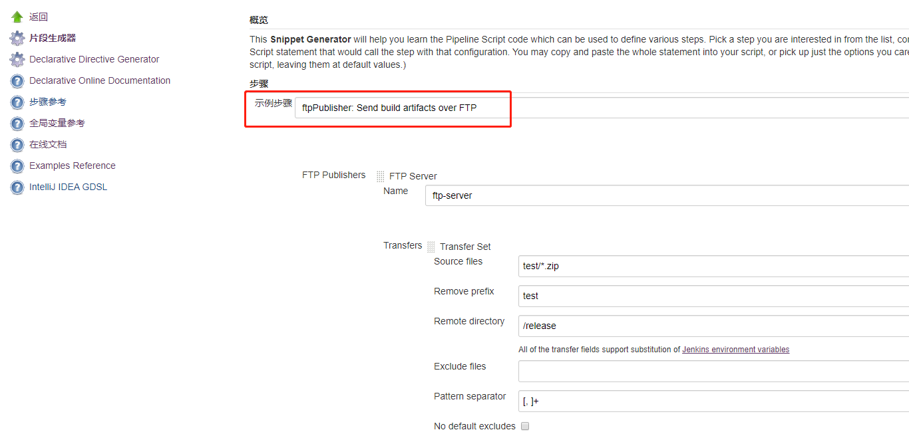

流水线中会存在将编译打包生成的文件上传到制品库，比较简单的做法就是搭建一个 FTP服务器，然后安装 Jenkins插件将文件上传

## 插件下载
在 Jenkins插件管理中搜索关键字 `ftp` 即可。  
google 到的结果大多都是 `Publish Over FTP`，是一个官方插件，所以下载这个肯定没错。  
同时我还注意到另外一个插件 [phoenix-autotest-plugin](https://github.com/jenkinsci/phoenix-autotest-plugin/blob/master/README.md), 感觉使用更加简单，
如下：
```groovy
phoenixFtp(serverHost: '192.168.1.1',
    credentialsId: 'a52b4173-cf98-47a0-bd02-3e9019a6082d',
    srcFile: 'pom.xml', targetDir: '.')
```
但需要在代码中指定 host和credentials， `Publish Over FTP` 则是全局配置，直接使用

## FTP 上传
`Publish Over FTP`的方式如下：
1. 在全局配置中配置好对应 FTP服务器，测试无误
2. 使用 [片段代码生成器](/jenkins/pipeline-syntax/#代码片段生成器) 生成目标流水线脚本片段
  
eg:
```groovy
ftpPublisher alwaysPublishFromMaster: false, 
  paramPublish: null,
  masterNodeName: '',
  continueOnError: false, 
  failOnError: true, 
  publishers: [[
    configName: 'ftp-server', 
    transfers: [[asciiMode: false, cleanRemote: false, 
      excludes: '', flatten: false, makeEmptyDirs: false, 
      noDefaultExcludes: false, patternSeparator: '[, ]+', 
      remoteDirectory: '/release', 
      remoteDirectorySDF: false, 
      removePrefix: 'test', sourceFiles: 'test/**/*.zip'
    ]], 
    ftpRetry: [
      retries: 10,
      retryDelay: 5000
    ],
    usePromotionTimestamp: false, useWorkspaceInPromotion: false, verbose: true
  ]]
```
::: warning
- `paramPublish`, `masterNodeName`是新版本里的必需参数，代码片段生成器没有把它们加上，需要手动添加
- 文件大小为0的空文件不会被上传
:::

## FTP 下载
```bash
curl -O ftp://<url>/path/to/specific/file
```
ftp插件居然只有上传没有下载的功能！！  
所以 ftp下载只能退而求其次了，一般装了 Git 根目录cmd下会自带 curl工具。  
或者封装一个脚本，调用实现该功能，这里给个 python脚本的示例 [ftp.py](https://gist.github.com/YxxY/dcd2cfbfbd37f6482a7018446a14c4b3)


## 参考
- [Publish Over FTP](https://wiki.jenkins.io/display/JENKINS/Publish+Over#PublishOver-publisher)
- [FTP Arguments](https://jenkins.io/doc/pipeline/steps/publish-over-ftp/)