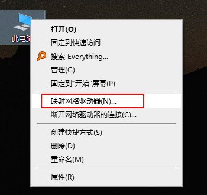
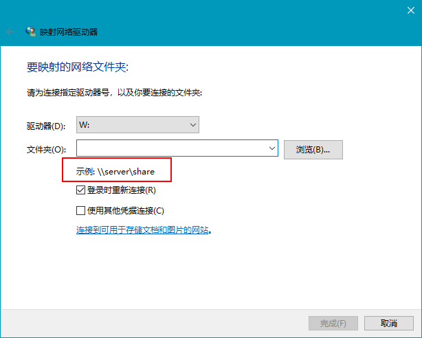

samba 服务允许 windows与unix系统相互访问资源，使用非常方便。
本文总结如何在 centos7 上安装 samba服务器

## 安装并启动samba服务
- 安装
  ```sh
    sudo yum install samba samba-client
  ```
- 启动服务并
  ```sh
    sudo systemctl start smb.service
    sudo systemctl start nmb.service
  ```
- 设置开机启动
  ```sh
    sudo systemctl enable smb.service
    sudo systemctl enable nmb.service
  ```

`smbd`服务会监听 TCP 139及445接口
`nmbd`服务会监听 UDP 137端口

## 创建用户以及目录结构
一般会存在一个管理员用户，及其它相互隔离的普通用户。  
目录结构，对应 smb协议，会存在多个 `share`, 分为两种类型
- public share，所有用户均可访问
- private share，特定用户才能访问

举例说明：
- 需要创建3个用户
  - 管理员：sadmin，
  - 普通用户：tom，jerry
- 需要创建两个 share，
  - 公用空间：public， 以上三个用户均能访问
  - 私有空间：tom，仅 tom 和 sadmin能访问

### 创建顶级目录
这里创建一个 `/samba` 的顶级命名空间, 存放后续所有内容
```sh
sudo mkdir /samba
```

### 创建用户组
创建用户组 `sambashare`, 后续所有samba用户均为该用户组成员
```sh
  sudo groupadd sambashare
```
samba 复用了 linux的用户和目录权限，这里给目录授予用户权限
```sh
  sudo chgrp sambashare /samba
```


### 创建用户
如上所说， samba用户和 linux用户是重合的，所以使用 useradd命令创建用户即可
```sh
  sudo useradd -M -d /samba/tom -s /usr/sbin/nologin -G sambashare tom
```
- `-M` do not create the user’s home directory. We’ll manually create this directory
- `-d` set the user’s home directory
- `-s` /usr/sbin/nologin - disable shell access for this user
- `-G` add the user to the sambashare group

同理创建 sadmin 和 jerry用户
```sh
sudo useradd -M -d /samba/public -s /usr/sbin/nologin -G sambashare sadmin
sudo useradd -M -d /samba/public -s /usr/sbin/nologin -G sambashare jerry
```
### 创建 share
```sh
sudo mkdir /samba/tom
sudo chown tom:sambashare /samba/tom
sudo chmod 2770 /samba/tom
```
```sh
sudo mkdir /samba/public
sudo chown sadmin:sambashare /samba/public
sudo chmod 2770 /samba/public
```

### 设置用户密码并使生效
将当前用户加入到 samba数据库中, 并设置用户密码
```sh
sudo smbpasswd -a tom
```
密码设置完毕后，使用户生效
```sh
sudo smbpasswd -e tom
```
同理设置其它用户密码并 enable即可

### 配置 samba share
```sh
sudo vim /etc/samba/smb.conf
```
设置配置如下：
```yml
[public]
    path = /samba/public
    browseable = yes
    read only = no
    force create mode = 0660
    force directory mode = 2770
    valid users = @sambashare @sadmin

[tom]
    path = /samba/tom
    browseable = no
    read only = no
    force create mode = 0660
    force directory mode = 2770
    valid users = tom @sadmin
```

添加或修改配置后，需重启相关服务生效
```sh
sudo systemctl restart smb.service
sudo systemctl restart nmb.service
```

### samba 客户端连接
客户端连接命令为 `smbclient //samba_hostname_or_server_ip/share_name -U username`
eg:
```sh
smbclient //127.0.0.1/tom -U tom
```

### windows 挂载
  


## 参考
- [how-to-install-and-configure-samba-on-centos-7](https://linuxize.com/post/how-to-install-and-configure-samba-on-centos-7/)