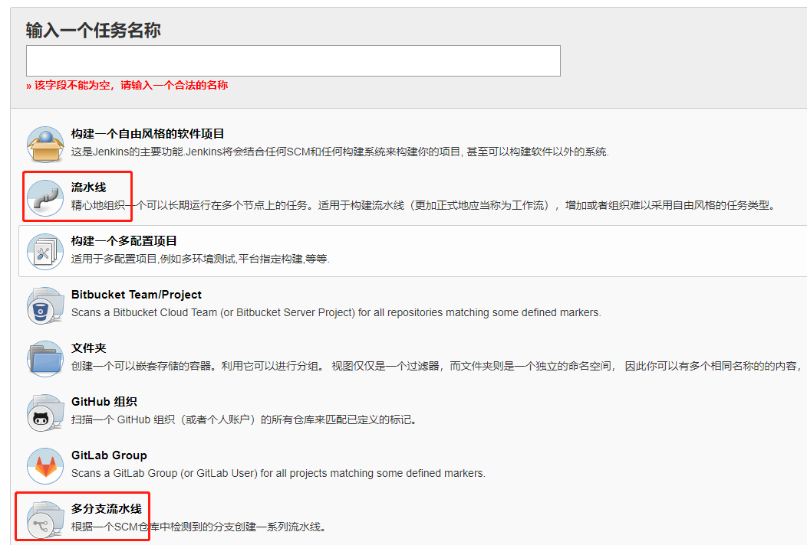

确认使用 Jenkins v2.0 的流水线任务方案后会面临两个选择，是选择使用 `流水线`还是 `多分支流水线`, eg：

## 流水线任务
- 流水线任务像是多个自由风格任务的整合
- 在一个任务里，可以指定多个子任务工作在不同的节点上
- 不再使用手工配置，而是使用编写 `Jenkinsfile`的方式作为配置入口和控制中心
- `Jenkinsfile`可以存放在 Jenkins服务器上，也可以放在源码的代码仓库中

## 多分支流水线任务
多分支流水线相当于是一个或多个流水线任务的集合。会根据设定的规则扫描代码仓库的目标分支，并使用分支名自动创建对应的流水线任务。  

普通的流水线任务也支持多分支，但是所有分支运行的是同一个任务，Jenkinsfile是共用的。  
多分支是每个分支对应自己的任务，Jenkinsfile可以是每个分支独立一份。  

多分支的优势是：
- 自动的分支发现并创建对应任务
- 更多的插件支持
- 某些环境变量只能在多分支流水线中使用, eg: `"${env.BRANCH_NAME}"`

也有一些问题：
- 流水线依旧是“手工配置”和“pipeline script” 的结合体，但多分支流水线去掉了更多的“手工配置”部分，
    替换成了“pipeline script”，并且把示例放在了比较隐蔽的地方： `<jenkins-url>/pipeline-syntax/`
        

## 参考文档
- [jenkins pipeline](https://jenkins.io/zh/doc/book/pipeline/)