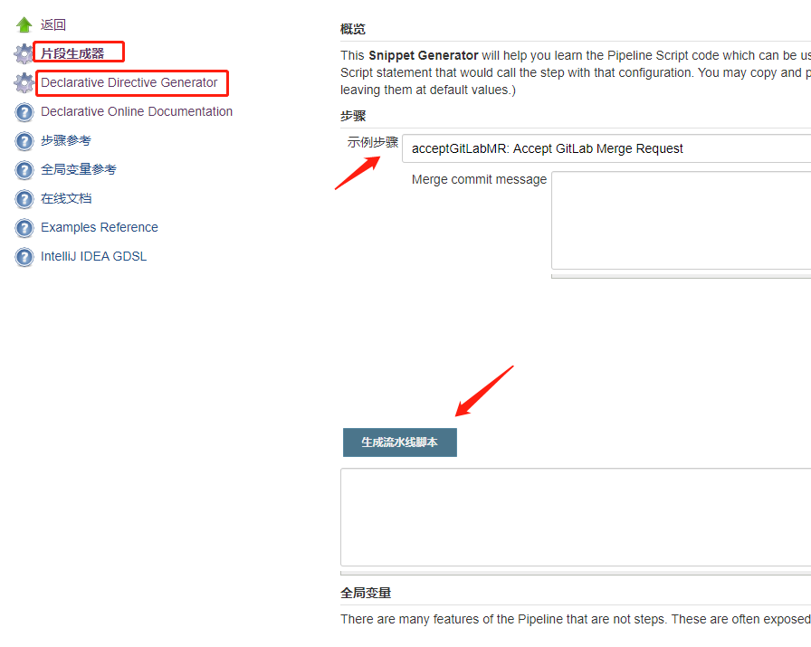

流水线脚本是流水线运行的核心，一般被命名为 `Jenkinsfile`. 功能作用类似于 Docker里的 `dockerfile`

编写时提供两种方式：
- 声明式(Declarative Pipeline)
- 脚本式(Scripted Pipeline)

脚本式流水线偏向于写逻辑控制。  
声明式流水线偏向于写配置，但可以引入一个 `script` 代码块来兼容脚本式流水线的写法。

总的来说，二者区别相差不大，可任意选择

## 声明式流水线
语法规则以 `pipeline`代码块包裹的写法既是声明式流水线，eg:
```groovy
pipeline {
    //statements
}
```
整个脚本是符合 groovy的语法环境，pipeline 区块里进一步定义了特定的语法规则，即：pipeline 是基于 groovy里的`DSL`

如果是使用声明式流水线，则有一些语句是必须的，eg:
```groovy
pipeline{
    agent none
    stages{
        stage('one'){
            steps{
                // step statements
                /* optional scripted operation
                script{

                }
                */
            }
        }
    }
}
```
- 顶层 `agent`必不可少，指定任务运行的默认节点，具体每个 `stage`可再自定义
- `stages`必需，且有且仅有一个，包含一系列一个或多个具体的`stage`
- `steps`同 `stages`作用很像，必需且有且仅有一个，位于 `stage`区块下，包含一系列一个或多个具体的 step
- `script`里可以兼容脚本式流水线的语法，比如写一些 if/else的流程判断等

## 代码片段生成器
Jenkins 提供一个生成部分基础操作的代码片段生成器页面。  

- 链接为 `<jenkins-url>/pipeline-syntax/`
- 跳转后可以看到以下页面

- 在“示例步骤”的下拉菜单中选择自己需要的步骤，填写参数，点击“生成流水线脚本”
- 同理可选择左侧导航栏的 “声明式指令生成器”，生成对应的声明式流水线片段
- “全局变量参考”里，展示一些可以直接在流水线中使用的全局变量，非常有用

## 基础 Groovy
pipeline 脚本是基于 groovy的 DSL，因此，很多 groovy的语法在 pipeline中是通用的  
Jenkins 还提供一个`脚本命令行`可在线调试运行 groovy脚本，地址在 `http://<jenkins-url>/script`

### 定义变量
- 使用 `def` 关键字
- 语句末尾的分号不是必须的
```groovy
def x = "hello world"
def y = 1
```
### 注释
- `//`, 双斜杠注释单行
- `/* */`, 注释多行

### 引号
- `单引号`，所见即所得，相当于 `Java`里的字符串
- `双引号`，支持模板插值，动态将变量替换为字符串，eg：`"${env.PATH}"`
- `三单引号`，支持换行，**不支持**插值
- `三双引号`，支持换行，支持插值

### 函数
- 和定义变量类似，eg:
```groovy
def func(String name){
    print name
    return 'hello ' + name
}
```
- 支持默认参数，eg：
```groovy
def func(String name = "world"){
   print "hello ${name}"
}
```
- 函数调用
    - 有参数时，可省略括号  
```groovy
//使用上例定义的函数 func
func('x')
func 'xx'
func name = 'xxx'
```

函数的定义具备变量提升的功能
```groovy
def ret = getProjectName('folder/project_name/branch_name')
print(ret)

def getProjectName(String fullName){
  def projectName = 'null'
  def first = fullName.indexOf('/')
  if(first == -1){
    projectName = fullName
  }else{
    def second = fullName.indexOf('/', first+1)
    if(second == -1){
  	  projectName = fullName.substring(first+1)
    }else{
  	  projectName = fullName.substring(first+1, second)
    }
  }
  return projectName
}
```


## 参考文档
- [pipeline syntax](https://jenkins.io/doc/book/pipeline/syntax/)
- [pipeline examples](https://github.com/jenkinsci/pipeline-examples)
- `<jenkins-server-url>/pipeline-syntax`