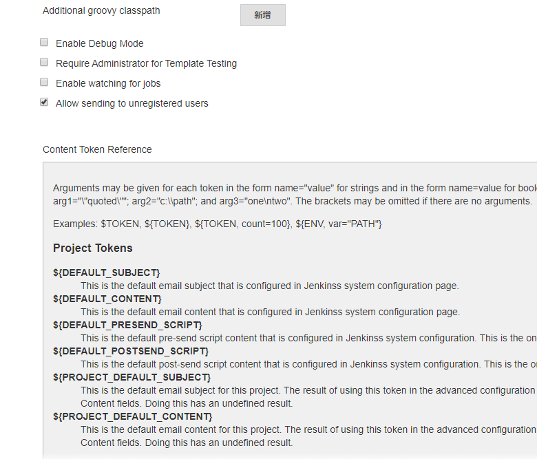

Jenkins 内置邮件发送客户端，只需配置邮箱服务器即邮件发送账户密码即可使用
## 配置
在`系统管理` -> `系统配置`页
- 在`Jenkins Location`区域下填写 `系统管理员邮件地址`, 即邮件发送者的邮箱地址
    - eg: `sender@example.com`
    - `Jenkins Notification <sender@example.com>`, 指定显示名
- 在`邮件通知` 或`扩展邮件通知`（安装对应插件）区域（即本页最下方)下填写邮箱配置信息
- 发送测试邮件测试无误即可

## 使用
一般会推荐安装 [Email Extension Plugin](https://jenkins.io/doc/pipeline/steps/email-ext/)，可以指定一些默认选项，比如邮件主题，内容，收件人等

在“自由风格项目”中可直接在构建后的步骤里引用该插件功能，选择触发策略即可。  
本文主要备注在 pipeline脚本中的使用。

### 使用默认邮件功能
默认的 mailer插件基本满足发邮件的功能，在流水线脚本中，通常结合 `post`区块来条件触发。eg：

```groovy
post {
    failure {
        mail subject: "Example Build: ${env.JOB_NAME} - Failed", 
            to: 'receiver@example.com', 
            replyTo: 'replyto@example.com', 
            mimeType: 'text/html',
            body: """
                    Job Failed - ${env.JOB_NAME} 
                    build id: ${env.BUILD_NUMBER}
                    View the log at: ${env.BUILD_URL}console
                    Blue Ocean: ${env.RUN_DISPLAY_URL}
                """
    }
}
```
详细的参数可以参考 [片段代码生成器](/jenkins/pipeline-syntax/#代码片段生成器) 

### 使用扩展插件
使用 `Email Extension Plugin`的示例如下:
```groovy
post {
    failure {
        emailext subject: '${DEFAULT_SUBJECT}',
          recipientProviders: [developers(), culprits()], 
          //也可以使用 "to"来动态指定，最后会合并收件人列表
          to: '$DEFAULT_RECIPIENTS',
          body: """<p>FAILED: Job '${env.JOB_NAME} [${env.BUILD_NUMBER}]':</p>
            <p>Check console output at &QUOT;<a href='${env.BUILD_URL}'>
            ${env.JOB_NAME} [${env.BUILD_NUMBER}]</a>&QUOT;</p>
            """
    }
}

```
优势在于收件人的填写上更加智能
- `culprits`, “罪魁祸首”，包含最后一次成功的构建到此次构建所有的代码提交者
- `developers`, 所有提交过改变的人
- `requestor`, 触发此次构建的人
- `brokenBuildSuspects`, 导致构建失败的嫌疑人
- `brokenTestsSuspects`, 导致单元测试失败的嫌疑人
- `upstreamDevelopers`, 触发此次构建的上游提交者
- `$DEFAULT_RECIPIENTS`, 全局配置的默认收件人（**注意使用时用单引号**）
- `$DEFAULT_REPLYTO`， 全局配置的默认回复人（**注意使用时用单引号**）

更多变量详情参考全局配置的详情页，如下：


### 使用模板
使用扩展插件的模板功能，默认提供了两个模板
- Text only template: `${SCRIPT, template="groovy-text.template"}`
- HTML template: `${SCRIPT, template="groovy-html.template"}`

也可以自己自定义脚本/模板，放在 `JENKINS_HOME/email-templates/`目录下（不存在可自行创建）  
eg:
```groovy
post {
    failure {
        emailext subject: '${DEFAULT_SUBJECT}',
          //使用默认收件人配置，也可以使用 "to"来动态指定
          recipientProviders: [developers(), culprits()], 
          to: '$DEFAULT_RECIPIENTS',
          mimeType: 'text/html',
          //注意body 外层是单引号，此处不是模板插值，不能使用双引号
          body: '${SCRIPT, template="groovy-html.template"}',
          replyTo: '$DEFAULT_REPLYTO'
          //末尾不能有多余的逗号
    }
}
```
### 添加附件
v2.15版本之后可以添加附件，文件路径名支持Ant 模式匹配，可全局设置文件大小限制（默认无限制）
```groovy
emailext subject: '${DEFAULT_SUBJECT}',
  recipientProviders: [requestor()], 
  to: '$DEFAULT_RECIPIENTS, alex',
  mimeType: 'text/html',
  body: '${SCRIPT, template="email.template"}',
  replyTo: '$DEFAULT_REPLYTO',
  //附件添加log
  attachLog: true,
  compressLog: true,
  //其它附件，基础路径为当前工作空间
  attachmentsPattern: 'module/dist/**/*.zip,*.txt'
```

## 参考文档
- [mailer](https://github.com/jenkinsci/mailer-plugin)
- [email-ext wiki](https://wiki.jenkins.io/display/JENKINS/Email-ext+plugin#Email-extplugin-PipelineExamples)
- [groovy-html.template](https://github.com/jenkinsci/email-ext-plugin/blob/master/src/main/resources/hudson/plugins/emailext/templates/groovy-html.template)
- [stackoverflow](https://stackoverflow.com/questions/37169100/use-jenkins-mailer-inside-pipeline-workflow/39499554#39499554)