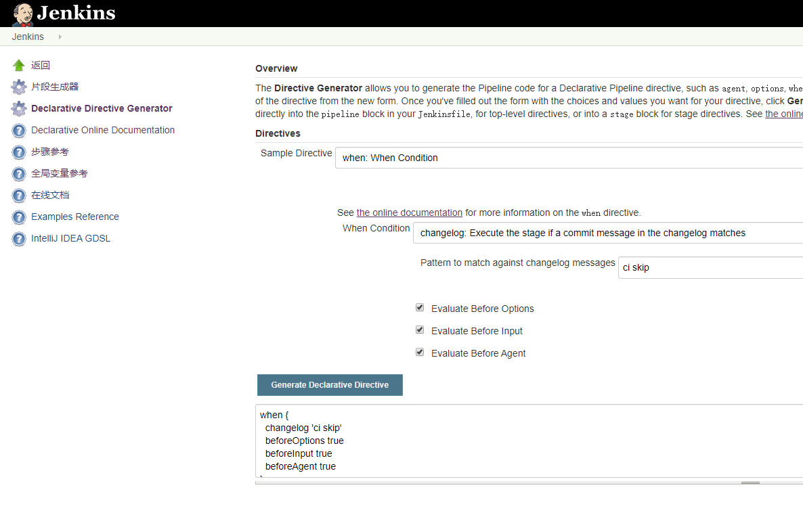

提交信息包括两部分
- commit message
- changed files

有时需要根据这两项内容做二次判断

## 使用构建策略插件
[Multibranch Build Strategy Extension Plugin](https://wiki.jenkins.io/display/JENKINS/Multibranch+Build+Strategy+Extension+Plugin) 插件可以根据 `changed files`的信息来决定是否触发/取消本次构建

## 使用提交信息进行判断
使用到的指令主要为：
- when
    - `<jenkins-url>/directive-generator/` 里选到 when  
- changelog
- changeset




::: warning
该功能为集成功能，根据当前自动拉取的提交信息判断输入条件。    
因此, **不能**使用全局配置的 skipDefaultCheckout，且要给当前 stage显式的指定 `agent`，
从而在 steps进行之前自动 checkout
:::

eg:
```groovy
stage('build'){
  agent {label 'dev'}
  when {
    changelog '[ci skip]'
  }
  steps{
    // checkout scm
    echo 'done!'
  }
}
```
::: tip
`changeset` 的使用同理
:::

## 使用命令
手动执行命令查询 commit message的方式
```groovy
stage('pre-build'){
  steps{
      checkout scm
      script {
        result = bat(script: "git log -1 | grep '\\[ci skip\\]'", returnStatus: true) 
          if (result != 0) {
            echo "build..."
          } else {
            echo "include [ci skip] info..."
          }
      }
  }
}
```