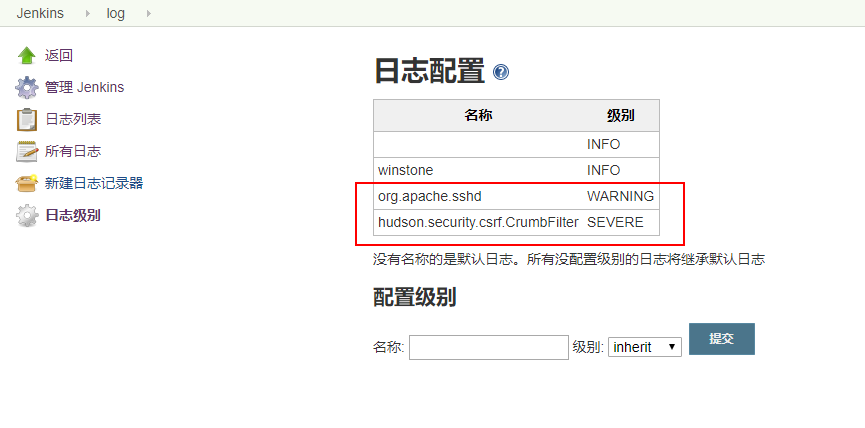

总结使用过程中遇到的一些坑

## Gitlab 仓库拉取失败
在任务中填写正确的 gitlab仓库地址及凭据后提示仓库不存在或者鉴权失败

#### 参考
- [The project you were looking for could not be found](https://gitlab.com/gitlab-com/support-forum/issues/638)

#### 解决方案
- 在 http链接中填写项目所有者信息
    ```bash
    #before:
    https://gitlab.com/my_gitlab_user/myrepo.git
    #after:
    https://my_gitlab_user@gitlab.com/my_gitlab_user/myrepo.git
    ```
- 使用 ssh+git地址链接

## 使用 HTTP地址的 Gitlab仓库信息错乱
gitlab仓库地址使用 HTTP链接时，流水线任务构建时会出现找不到正确的分支及提交信息错乱的bug

#### 参考
- [Jenkins will not match repository if pulling from HTTP](https://github.com/jenkinsci/gitlab-plugin/issues/477)
- [the gitlab plugin can not get the correct branch](https://github.com/jenkinsci/gitlab-plugin/issues/444)

#### 解决方案
插件 bug修复前使用 ssh+git地址链接

## 修改子节点环境变量不生效
子节点和 master节点建立连接后再去修改子节点环境变量不生效

#### 参考
- [Changes to slave environment variables are ignored by master](https://issues.jenkins-ci.org/browse/JENKINS-27739?page=com.atlassian.jira.plugin.system.issuetabpanels%3Acomment-tabpanel&showAll=true)

#### 解决方案
断开连接，重新建立


## 无效日志频繁打印
#### 参考
- [hudson.security.csrf.CrumbFilter](https://issues.jenkins-ci.org/browse/JENKINS-40344)

#### 解决方案
增加全局日志过滤器，`Jenkins->Manage->System Log->Log Levels`  



## 多分支流水线 webhook不生效
多分支流水线存在重启后 webhook不生效，甚至配置丢失的情况
#### 参考
- [JENKINS-60143](https://issues.jenkins-ci.org/browse/JENKINS-60143)


## 如何中断流水线
```groovy
currentBuild.result = 'ABORTED'
error('Aborting the build.')
```

## 如何重置构建ID
到 `http:<jenkins-url>/script`下执行
```groovy
item = Jenkins.instance.getItemByFullName("<FULL-PROJECT-NAME>")
//THIS WILL REMOVE ALL BUILD HISTORY
item.builds.each() { build ->
  build.delete()
}
item.updateNextBuildNumber(1)
```

## 计算human readable时间差
1. 到 /scriptApproval 下增加如下授权：  
`staticMethod groovy.time.TimeCategory minus java.util.Date java.util.Date`
2. groovy语法如下：
```groovy
import groovy.time.TimeCategory 
import groovy.time.TimeDuration
Date start = new Date(currentBuild.startTimeInMillis)
Date now = new Date()
TimeDuration td = TimeCategory.minus( stop, start )
println td
        
```